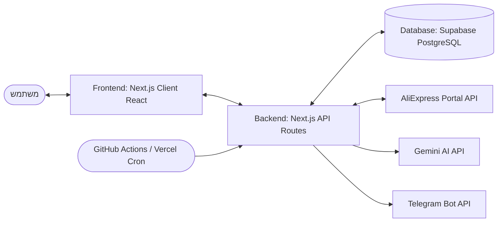

# מסמך אפיון וארכיטקטורה: Backend & Frontend

מסמך זה מפרט את המבנה הטכני של מערכת הבוט, כולל קשרים בין ממשק המשתמש (Frontend), ה-API (Backend), מנוע התזמון (Scheduler), בסיס הנתונים (Prisma + Supabase PostgreSQL) והתממשקות חיצונית (AliExpress / Telegram / Gemini).

---

## 1. ארכיטקטורת המערכת (System Overview)

המערכת בנויה בטכנולוגיית **Next.js 14 (App Router)** ופועלת באופן מלא כ-Serverless ב-Vercel.



---

## 2. אפיון צד לקוח (Frontend Specification)

ממשק המשתמש ממומש באמצעות React (Client Components) תחת תיקיית `src/app/`.

### דפים מרכזיים
1. **דשבורד ראשי (`src/app/page.tsx`):**
   * מציג מונים בזמן אמת (פורסמו היום, ממתינים, שגיאות, ועמלות).
   * מציג את ביצועי AliExpress (קליקים והזמנות משולמות/שהושלמו ב-7 הימים האחרונים).
   * מציג רשימה של פרסומים אחרונים וערוצים פעילים.
   * מכיל מתג הפעלה/כיבוי של הבוט וכן כפתור **"סרוק מוצרים עכשיו"** להפעלה ידנית.
2. **תור האישורים והעריכה (`src/app/queue/page.tsx`):**
   * מציג מוצרים במצב `pending` שהתקבלו מהסריקה ועברו עיבוד תוכן AI.
   * מאפשר למנהל לערוך את הטקסט בעברית (כותרת, תיאור, קישור), לאשר פרסום מיידי או לדחות/למחוק.
3. **הגדרות מערכת (`src/app/settings/page.tsx`):**
   * **לשונית חיבורים:** ניהול מפתחות API של AliExpress ו-Gemini.
   * **לשונית ערוצים:** ניהול ערוצי טלגרם, הגדרת מזהה צ'אט, טוקן בוט, קטגוריות סריקה ותדירות פרסום.
   * **לשונית כללי סינון:** קביעת עמלה מינימלית, דירוג מינימום, כמות מכירות מינימום וטווח מניעת כפילויות.
   * **לשונית תבניות:** הגדרת Prompt המערכת ותבנית הנתונים של ה-AI.
4. **הזנה ידנית (`src/app/manual/page.tsx`):**
   * מאפשר להזין קישור מוצר של AliExpress ישירות, לבצע מונטיזציה ולהעבירו למסלול AI ופרסום ידני.

---

## 3. אפיון צד שרת (Backend Specification)

כל נקודות הקצה ממומשות כ-API Routes תחת תיקיית `src/app/api/`.

### נקודות קצה (API Endpoints)

#### אבטחה ואימות
כל נקודות קצה מסוג קרון/סריקה (Cron Jobs) מאובטחות באמצעות בדיקת כותרת אימות `Authorization: Bearer <CRON_SECRET>`. בקשות ללא מפתח מתאים או ללא הגדרה של המפתח בשרת יידחו עם קוד שגיאה `401 Unauthorized`.

#### פירוט ה-API:
1. **`GET/POST /api/settings`**: לשליפה ושמירה של הגדרות גלובליות וערוצים בטבלאות המסד. (הערה: ה-GET מחזיר גם את ה-`CRON_SECRET` מהשרת לצורך אימות הפרונט).
2. **`POST /api/products/scan`**: מפעיל באופן מיידי סריקה ידנית מול AliExpress.
3. **`GET/POST /api/cron/run`**: מופעל על ידי GitHub Actions או Vercel Cron. מריץ את ה-Orchestrator:
   * מפעיל סריקת מוצרים חדשים.
   * מעבד עד 10 מוצרים ללא תרגום ב-Gemini.
   * בודק זמני פרסום של ערוצים ומפרסם את המוצר הבא בתור לכל ערוץ פעיל.
4. **`GET/POST /api/cron/review`**: קרון יומי השולח דוח מייל באמצעות Resend API עם ניתוח ביצועים מבוסס AI.
5. **`GET /api/dashboard/stats`**: מספק את הנתונים המספריים והסטטיסטיקות לעמוד הראשי.
6. **`GET /api/performance`**: שולף את ביצועי האפיליאציה האמיתיים מ-AliExpress (כמות קליקים והזמנות).

---

## 4. מודל נתונים (Prisma Schema Models)

```prisma
model Product {
  id                  String      @id @default(uuid())
  aliexpressProductId String
  titleOriginal       String
  titleHe             String?
  bodyHe              String?
  bulletsHe           String?     // JSON array as string
  ctaHe               String?
  priceOriginal       Float
  priceDiscounted     Float
  discountPercent     Int
  imageUrl            String
  affiliateLink       String?
  categoryId          String
  commissionRate      Float
  rating              Float       // Feedback % (0-100)
  salesCount          Int
  status              String      @default("pending") // pending | approved | published | rejected | ai_failed | publish_failed | publishing
  retryCount          Int         @default(0)
  lastError           String?
  channelId           String
  publishedAt         DateTime?
  createdAt           DateTime    @default(now())
  updatedAt           DateTime    @updatedAt
  
  channel             Channel     @relation(fields: [channelId], references: [id])
  publishLog          PublishLog[]

  @@unique([aliexpressProductId, channelId])
}

model Channel {
  id                   String      @id @default(uuid())
  name                 String
  telegramChatId       String
  botToken             String
  categories           String      // JSON array of AliExpress category IDs
  isActive             Boolean     @default(true)
  autoPublish          Boolean     @default(false)
  publishIntervalHours Int         @default(6)
  lastPublishedAt      DateTime?
  createdAt            DateTime    @default(now())
  updatedAt            DateTime    @updatedAt
  
  products             Product[]
  publishLog           PublishLog[]
  orders               Order[]
}

model Setting {
  key       String   @id
  value     String
  updatedAt DateTime @updatedAt
}

model Order {
  id             String    @id @default(uuid())
  aliOrderId     String    @unique
  channelId      String?
  productTitle   String?
  orderStatus    String
  commissionFee  Float     @default(0)
  commissionRate Float     @default(0)
  paidAmount     Float     @default(0)
  orderCreatedAt DateTime
  fetchedAt      DateTime  @default(now())

  channel        Channel?  @relation(fields: [channelId], references: [id])
}

model PublishLog {
  id            String    @id @default(uuid())
  productId     String
  channelId     String
  telegramMsgId String?
  publishedAt   DateTime  @default(now())
  status        String    // success | failed
  errorMessage  String?
  
  product       Product   @relation(fields: [productId], references: [id])
  channel       Channel   @relation(fields: [channelId], references: [id])
}
```
