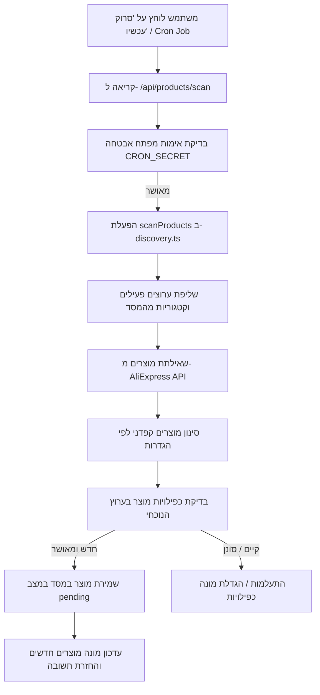

# מדריך סריקת מוצרים: Frontend, Backend ו-QA

מסמך זה מתאר את ארכיטקטורת מנוע סריקת המוצרים (Discovery Engine) של הבוט, כולל אופן העבודה של צד הלקוח (Frontend), צד השרת (Backend) ותוכנית הבדיקות (QA) לאיתור ופתרון תקלות סריקה.

---

## 1. ארכיטקטורת זרימת המידע (Data Flow Architecture)



---

## 2. צד לקוח (Frontend)

### אופן הפעולה בממשק
הכפתור **"סרוק מוצרים עכשיו"** ממוקם בלוח הבקרה הראשי (`src/app/page.tsx`).
בלחיצה עליו מתבצעות הפעולות הבאות:
1. שליחת קריאת `GET` ל-`/api/settings` כדי לשלוף את הגדרות המערכת ומפתח האבטחה (`cron_secret`).
2. במידה וקיים מפתח אבטחה, הוא מוזרק לכותרת השאילתה: `Authorization: Bearer <cron_secret>`.
3. שליחת קריאת `POST` ל-`/api/products/scan`.
4. הצגת הודעת סטטוס מפורטת: כמות מוצרים שנסרקו, כמות מוצרים חדשים שנוספו לתור, וכמות כפילויות שסוננו.

> [!IMPORTANT]
> **הערת אבטחה ותקלה נפוצה בפרונט:**  
> אם משתנה האבטחה `CRON_SECRET` מוגדר אך ורק ב-Vercel Environment Variables ולא בטבלת ה-Settings במסד הנתונים, השרת יצפה לאימות (מכיוון שהוא קורא מ-`process.env`), אך הלקוח לא יידע על קיומו (מכיוון שאינו חשוף לקוד הפרונט). במצב זה השאילתה תיכשל עם שגיאת **`401 Unauthorized`**.  
> **פתרון:** השרת מעדכן כעת את קריאת ה-`/api/settings` כך שתחזיר את מפתח ה-Cron מהסביבה באופן מבוקר לצורך הפעלת הסריקה הידנית.

---

## 3. צד שרת (Backend)

### קריאות ה-API הרלוונטיות
* **`POST /api/products/scan`**: נקודת הקצה שמפעילה את הסריקה המיידית (ידנית).
* **`POST /api/cron/run`**: נקודת הקצה הראשית של ה-Cron (מופעלת אוטומטית מ-GitHub Actions) המפעילה את ה-Orchestrator שמריץ סריקה, הפקת תוכן AI ופרסום.

### לוגיקת הסינון והסריקה (`src/lib/discovery.ts`)
מנוע הסריקה פועל על כל קטגוריה המוגדרת בערוצים הפעילים. לכל קטגוריה מתבצעות הפעולות הבאות:

1. **שילוב סבב דפים (Page Rotation):**  
   כדי לא לסרוק תמיד את אותם מוצרים ראשונים, המערכת שומרת הגדרה בשם `scan_page_offset` ומקדמת אותה בכל סריקה (דפים 1 עד 5 בלחיצה).
2. **שאילתה ל-AliExpress API:**  
   שליפת 50 מוצרים מהקטגוריה לפי מיון **`sort: 'LAST_VOLUME_DESC'`** (המוצרים הנמכרים ביותר — מבטיח מוצרים איכותיים עם עמלות יציבות).
3. **מעבר על המוצרים וסינון קפדני:**
   * **עמלה (`min_commission_rate`):** ברירת מחדל מינימום `2%`.
   * **ציון פידבק חיובי (`min_rating`):** דירוג חיובי באחוזים (0-100), ברירת מחדל מינימום `80%`.
   * **נפח מכירות (`min_sales`):** כמות מכירות מינימלית למוצר, ברירת מחדל מינימום `10` מכירות.
   * **אחוז הנחה (`discount`):** חייב להיות גדול מ-`0%`.
4. **מניעת כפילויות (Deduplication):**  
   המערכת בודקת האם קיים מוצר זהה באותו ערוץ טלגרם שנוצר בטווח של `dedup_days` (ברירת מחדל 30 יום). אם קיים, הוא מסומן ככפול ומנוטרל.

---

## 4. מדריך QA ובדיקות איתור תקלות (QA Troubleshooting Guide)

כאשר מופיעה הודעת שגיאה בסריקה ("שגיאה בסריקה") או שלא מתווספים מוצרים חדשים, יש לבצע את הבדיקות הבאות לפי הסדר:

### שלב א': בדיקת הרשאות ואימות (Authentication Test)
* **התקלה:** שגיאת `Unauthorized` (401) על המסך.
* **בדיקה:** ודא שמשתנה הסביבה `CRON_SECRET` מוגדר באופן זהה הן ב-Vercel והן ב-GitHub Secrets (אם רץ דרך Actions). 
* **בדיקה ידנית ב-cURL:**
  ```bash
  curl -X POST -H "Authorization: Bearer <הכנס_את_הטוקן_שלך>" https://<your-app>.vercel.app/api/products/scan
  ```

### שלב ב': בדיקת הגדרות סינון קפדניות מדי (Over-filtering Test)
* **התקלה:** הסריקה מסתיימת בהצלחה אך תמיד מציגה `0 מוצרים חדשים` ו-`0 כפילויות`.
* **הסבר:** הגדרות הסינון שלך קפדניות מדי עבור קטגוריה זו (למשל דרישה למינימום 100 מכירות וציון פידבק גבוה במיוחד, בעוד שהמוצרים הראשונים שנמצאו אינם עומדים בזה).
* **פתרון בדיקות:**
  1. היכנס ללשונית **הגדרות מערכת ← כללי סינון וסריקה**.
  2. הורד את **עמלת השותפים המינימלית** ל-`2%`.
  3. הורד את **כמות המכירות המינימלית** ל-`10`.
  4. הורד את **ביקורות חיוביות מינימום** ל-`80%`.
  5. בצע סריקה מחדש ובדוק אם התווספו מוצרים.

### שלב ג': בדיקת תקינות מפתחות AliExpress API (API Credentials Test)
* **התקלה:** שגיאת שרת פנימית (500) או שגיאה המכילה טקסט של AliExpress API.
* **בדיקה:**
  1. ודא שהמפתחות `ALIEXPRESS_APP_KEY` ו-`ALIEXPRESS_APP_SECRET` מוגדרים נכון.
  2. ודא שאין רווחים מיותרים לפני או אחרי המפתחות ב-Vercel / בקובץ `.env.local`.
  3. בדוק את לוג השרת ב-Vercel (Logs) – חפש הודעות שגיאה רשמיות מאליאקספרס (כגון מפתח פג תוקף, שגיאת חתימה `Invalid signature` וכדומה).

### שלב ד': בדיקת כפילויות בבסיס הנתונים (Database Dupes Test)
* **התקלה:** מספר רב של כפילויות (Duplicates) מונע הכנסת מוצרים חדשים.
* **בדיקה:** הרץ שאילתה ב-Supabase SQL Editor כדי לבדוק את התפלגות המוצרים הממתינים והקיימים:
  ```sql
  SELECT status, COUNT(*) FROM "Product" GROUP BY status;
  ```
  במידה וכל המוצרים ההיסטוריים עדיין קיימים במצב `rejected` או `published`, המערכת תסנן אותם. לצורך QA ובדיקות ראשוניות, ניתן לנקות את המוצרים הישנים כדי לאפשר סריקה חלקה:
  ```sql
  DELETE FROM "Product";
  ```
